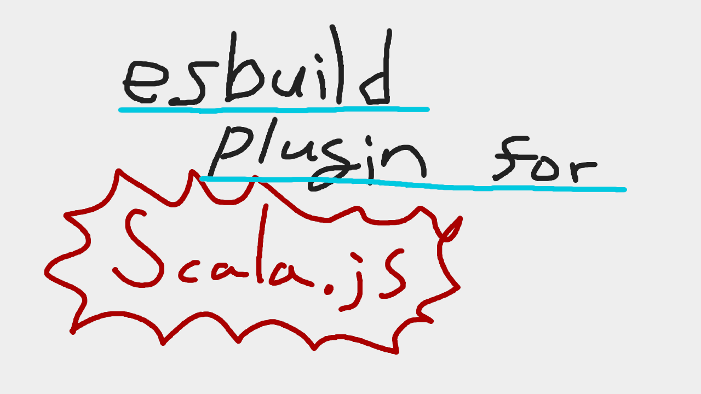

## esbuild plugin for Scala.js (currently just PoC)

This plugin provides esbuild plugin that enables bundle Scala.js code in your project.

### TODO

- make project name, etc. configurable
- publish this plugin into npm
- self bootstrap
- scala steward

### Usage

- install this plugin
- import scala.js module with `import { exportedSth } from 'scala:foobarmodule'`
